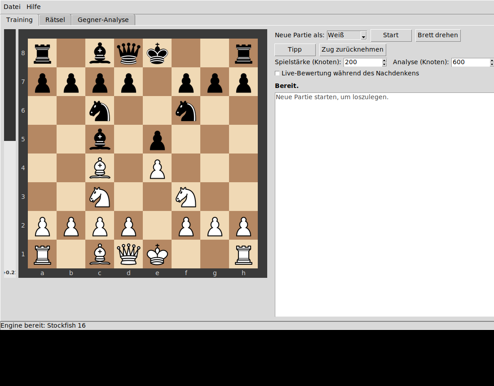

# Schach-Tutor (LC0)



Trainingspartner, persönliches Taktik-Training und Gegner-Analyse in Python auf
Basis von **LC0** (oder jeder anderen UCI-Engine). Drei Modi:

**Training** – Du spielst gegen die Engine. Nach jedem deiner Züge vergleicht
das Programm deinen Zug mit dem Engine-besten Zug. Bei Ungenauigkeit (?!),
Fehler (?) oder Patzer (??) bekommst du sofort eine Erklärung: *warum* der Zug
schlecht war (hängende Figur, Gabel, Matt übersehen/zugelassen, verpasste
Taktik), was besser gewesen wäre (mit Variante) und wie der Gegner bestrafen
könnte. Fehler und Patzer kannst du zurücknehmen und die Stellung sofort noch
einmal versuchen. Dazu: Tipp-Pfeil, Bewertungsbalken, einstellbare Spielstärke
und optional ein Polyglot-Eröffnungsbuch für abwechslungsreiche Engine-Züge.

**Rätsel** – Eigene Partien (PGN) laden, und aus *deinen* Fehlern entsteht ein
persönliches Taktik-Deck, wie die Rätsel auf chess.com – nur dass jedes Rätsel
eine Stellung ist, in der du selbst danebengegriffen hast: „Finde den Zug, den
du damals nicht gesehen hast." Jeder Kandidat wird mit multipv=2 nachgerechnet
und nur übernommen, wenn die Lösung eindeutig ist (klarer Win-%-Abstand zum
zweitbesten Zug); Mattführungen und erzwingende Schachfolgen werden über
mehrere Züge verfolgt. Beim Lösen akzeptiert die Engine auch gleichwertige
Alternativzüge. Gelöste Rätsel wandern nach dem **Leitner-System** in höhere
Boxen (Wiederholung nach 1/3/7/21 Tagen), Fehlversuche setzen sie zurück – eine
Schwäche verschwindet erst aus dem Deck, wenn du sie wiederholt sicher löst.
Die Statistik zeigt die Erfolgsquote je Fehlermuster („deine Schwächen,
schwächste zuerst").

**Widerlegungs-Rätsel** ergänzen die Gegner-Analyse: Ein Klick im
Gegner-Analyse-Tab erzeugt aus allen ?/??-Zügen des analysierten Spielers
Rätsel, bei denen *du* die Bestrafung finden musst — die Stellung nach seinem
typischen Patzer, mit derselben Eindeutigkeitsprüfung. So übst du genau die
Geschenke, die dieser Gegner erfahrungsgemäß verteilt (Quelle „Widerlegung"
im Rätsel-Tab).

**Gegner-Analyse** – Eine PGN-Datei mit Partien eines Spielers laden (z. B.
Lichess-Export unter `lichess.org/@/SPIELERNAME` → „Partien exportieren“).
Das Programm rechnet jede Stellung durch und erzeugt ein **Dossier**:
Fehlerquote nach Partiephase (ACPL), wiederkehrende Fehlermuster, das
Eröffnungsrepertoire mit Score je Eröffnung, markante Patzer als Beispiele und
konkrete **Vorbereitungs-Empfehlungen** („Endspiele anstreben“, „Eröffne mit
1.e4“, „In Caro-Kann holt er nur 25 %“ …). Jede analysierte Partie lässt sich
Zug für Zug reviewen; aus jeder Stellung heraus kannst du direkt gegen die
Engine weitertrainieren („Ab hier gegen Engine trainieren“).

**Beobachten** – Laufende Partien direkt in der App verfolgen. Lichess wird
in Echtzeit gestreamt (öffentliche ND-JSON-API, automatischer Reconnect bei
Verbindungsabbruch); bei Chess.com stellt die öffentliche API nur laufende
*Daily*-Partien bereit, die alle 12 Sekunden abgefragt werden — Live-Blitz/
Rapid ist dort nicht öffentlich zugänglich. Dazu Zugliste, Uhren und auf
Wunsch die **LC0-Bewertung in Echtzeit** (Balken + beste Fortsetzung) —
ideal, um den nächsten Gegner beim Spielen zu scouten. Endet die Partie,
lässt sie sich direkt über den Import im Gegner-Analyse-Tab auswerten.

## Installation

```bash
sudo apt install python3-tk        # Tkinter (GUI), unter Ubuntu/Mint
pip install -r requirements.txt    # python-chess + pillow
python main.py
```

Pillow ist optional (ohne fällt das Brett auf Unicode-Figuren zurück),
für den Cburnett-Look aber empfohlen.

Beim ersten Start öffnet sich der Einstellungsdialog, falls die Engine nicht
gefunden wird.

## Konfiguration für LC0

Beim ersten Start öffnet sich der Einstellungsdialog (Datei →
Einstellungen). Typische Werte je nach GPU:

| Feld    | NVIDIA (CUDA/TensorRT)                | AMD (ROCm)                        |
|---------|----------------------------------------|-----------------------------------|
| Engine  | `…/lc0/build/release/lc0`              | `…/lc0/build/rocm/lc0`            |
| Backend | `cuda-fp16` oder `onnx-trt`            | `rocm-fp16`                       |
| Weights | Netzdatei, z. B. `BT4-1740.pb.gz`      | dito                              |
| Buch    | optional: Polyglot-`.bin`              | dito                              |

Die Einstellungen liegen pro Installation in `settings.json` (nicht im
Repository).

LC0 wird als `lc0 --weights=… --backend=rocm-fp16` gestartet. Trägt man statt
LC0 eine andere UCI-Engine ein (z. B. `/usr/games/stockfish`), wird sie ohne
diese Argumente gestartet – praktisch zum Testen ohne GPU.

**Wichtig:** Der gesamte UCI-Verkehr läuft über *einen* Worker-Thread
(`engine_hub.py`), denn LC0 verträgt keinen nebenläufigen Zugriff
(`CommandState.NEW`-Fehler). Läuft gerade eine Gegner-Batch-Analyse, wartet
das Training deshalb, bis die Warteschlange frei ist.

## Schnelltest ohne GUI

```bash
python selftest.py                                  # Engine aus settings.json
python selftest.py --engine /usr/games/stockfish    # beliebige UCI-Engine
python selftest.py --nodes 5000
python gui_smoke.py                                 # GUI-Test (mit Display)
xvfb-run -a python gui_smoke.py                     # … oder headless
```

Acht Tests decken Klassifikation, Motiv-Erkennung, Dossier, Rätsel-Erzeugung
(eigene Fehler + Widerlegungen), Leitner-Logik, das Polyglot-Gegner-Buch
(inkl. Rochade-Kodierung) und den Lichess-Export (Offline-Stub) ab. Der
GUI-Rauchtest startet zusätzlich die komplette Oberfläche. Beides läuft in
der CI (GitHub Actions) mit Stockfish.

## Wie die Bewertung funktioniert

Für jede Stellung liefert die Engine Bewertung + Hauptvariante. Der Verlust
eines Zuges wird nicht in rohen Centipawns gemessen, sondern als Differenz der
**Gewinnwahrscheinlichkeit** (Win-%-Modell wie bei Lichess:
`50 + 50·(2/(1+e^(−0.00368·cp)) − 1)`). Schwellen: ≥ 10 % → Ungenauigkeit,
≥ 20 % → Fehler, ≥ 30 % → Patzer. Das verhält sich in klar gewonnenen oder
verlorenen Stellungen deutlich vernünftiger als cp-Differenzen. Der von der
Engine beste Zug wird nie beanstandet (Analyse-Rauschen). ACPL im Dossier =
mittlerer Centipawn-Verlust pro Zug, gedeckelt bei 1000.

Die *Warum*-Erklärungen sind Heuristiken über der Engine-Widerlegung: Wird die
gezogene Figur einfach geschlagen? Erzeugt die Antwort eine Gabel mit/ohne
Schach? Gab es ein übersehenes Matt oder eine verpasste Gewinnfortsetzung?
Notation ist internationale SAN (N/B/R/Q/K), wie auf Lichess.

## Gegner-Simulation: gegen „ihn" üben

Ein Netz, das *exakt* wie ein bestimmter Gegner spielt, geben 20 Partien
nicht her (dafür bräuchte man Tausende — siehe unten). Die praktische
Annäherung besteht aus zwei Bausteinen, die genau die zwei identifizierbaren
Anteile eines Spielstils abdecken:

1. **Sein Repertoire → Gegner-Buch.** Im Gegner-Analyse-Tab „Gegner-Buch
   (.bin) erzeugen" klicken: Es entsteht ein Polyglot-Buch aus exakt den
   Zügen, die er gespielt hat (häufigkeitsgewichtet, bis Zug 15). Als
   Engine-Buch übernommen, eröffnet die Trainings-Engine wie er.
2. **Seine Spielstärke → Maia-Netz.** Die Maia-Netze (CSSLab) sind
   LC0-Gewichte, die aus Millionen menschlicher Partien je Wertungsklasse
   trainiert wurden — sie spielen *menschlich* auf dem jeweiligen Niveau,
   inklusive menschentypischer Fehler (hängende Figuren, übersehene Gabeln:
   genau die Muster aus dem Dossier). Download: maia-1100 … maia-1900 unter
   https://github.com/CSSLab/maia-chess (Releases). In den Einstellungen:
   Weights = `maia-XXXX.pb.gz`, **Spiel-Knoten = 1** (offizielle Empfehlung —
   mehr Knoten machen Maia unmenschlich stark), Buch = das Gegner-Buch.

Dann im Training-Tab eine neue Partie starten: Die Engine eröffnet mit
seinem Repertoire und spielt danach wie ein Mensch seiner Stärke. Die
Widerlegungs-Rätsel aus seinen konkreten Fehlern ergänzen das Training.

**Alle Partien nutzen (Lichess- & Chess.com-Import):** Im Gegner-Analyse-Tab
die Quelle wählen (Lichess oder Chess.com), Nutzernamen eintragen, „Partien
laden" — das Tool zieht bis zu 2000 gewertete Partien über die jeweilige
öffentliche API und lädt sie direkt in die Partienliste. Lichess liefert
einen PGN-Stream (Drossel ~20 Partien/s, also ~1–2 Minuten für 1400);
Chess.com wird über die Monatsarchive der Published-Data-API vom neuesten
Monat rückwärts eingesammelt (nur Standard-Schach — Varianten wie Chess960
werden übersprungen — gewertet, Blitz/Rapid/Daily). Alternativ per Hand:
`curl -H "Accept: application/x-chess-pgn"
"https://lichess.org/api/games/user/<NAME>?max=2000&rated=true&perfType=blitz,rapid,classical"
-o gegner.pgn`. Empfehlung bei großen Archiven: Das **Gegner-Buch** immer aus
*allen* Partien bauen (braucht keine Engine, dauert Sekunden) — für Dossier
und Widerlegungs-Rätsel reichen die **letzten 200–300 Partien** (aktuelle
Form; ältere Partien zeigen einen Spieler, den es so nicht mehr gibt).

**Ausbaustufe (echtes Individual-Modell):** Ist der Gegner Lichess-Nutzer,
lässt sich sein komplettes Partienarchiv über die Lichess-API exportieren
(`lichess.org/api/games/user/<name>`). Mit Tausenden Partien wird
Maia-Feintuning auf eine Einzelperson realistisch (Forschung: „Learning
Models of Individual Behavior in Chess", McIlroy-Young et al., KDD 2022;
Code: github.com/CSSLab/maia-individual) — GPU-seitig wärst du mit MI50 und
der Blackwell bestens ausgestattet, der Aufwand liegt aber eher bei Tagen
als Stunden. Buch + Maia liefern den Großteil des Nutzens sofort.

## Knoten-Richtwerte (MI50, BT4)

- **Analyse (Training):** 400–1200 Knoten – Feedback in Sekundenbruchteilen.
- **Spielstärke:** 1–400 Knoten. LC0 ist selbst bei 1 Knoten (reine Policy)
  noch stark; für menschlichere Sparringspartner die **Maia-Netze**
  (maia-1100 … maia-1900) als Weights eintragen und Spiel-Knoten = 1 setzen.
  Fürs Feedback dann aber wieder ein starkes Netz verwenden – ein Engine-Slot,
  ein Netz.
- **Gegner-Analyse:** 100–300 Knoten pro Stellung reichen für ein belastbares
  Profil. Eine 40-Züge-Partie hat ~80 Stellungen; bei z. B. 3–5 knps sind das
  wenige Sekunden pro Partie. Ergebnisse werden je (Partie, Knotenzahl) in
  `cache/` abgelegt – ein zweiter Lauf ist sofort fertig.
- **Rätsel:** Die Analyse der eigenen Partien nutzt denselben Cache (gleiche
  Knotenzahl → sofort). Die Eindeutigkeits-Prüfung (Prüf-Knoten) darf ruhig
  höher liegen: 800–2000 Knoten; pro Fehler sind das nur eine Handvoll
  Engine-Aufrufe. Das Deck liegt in `puzzles.json`.

## Dateien

```
main.py           Start
app.py            Hauptfenster, Menü, Einstellungen, Engine-Neustart
engine_hub.py     Serieller UCI-Worker (Queue) für LC0
analysis.py       Win-%-Modell, Urteil (?!/?/??), Motive, deutsche Texte
opponent.py       PGN-Batch-Analyse, Cache, Profil, Dossier-Text
puzzles.py        Rätsel-Erzeugung (Eindeutigkeit, Mattlinien), Leitner-Deck
opponent_book.py  Polyglot-Buch aus den Zügen eines Spielers
lichess.py        Partien-Export über die Lichess-API
live.py           Laufende Partien: Lichess-Stream, Chess.com-Daily
live_tab.py       Beobachten-Tab (Live-Brett, Uhren, Echtzeit-Bewertung)
chesscom.py       Partien-Export über die Chess.com-API (Monatsarchive)
puzzle_tab.py     Rätsel-Training (Lösen, Tipps, Statistik)
pieces.py         Eingebettete Cburnett-Figurenbilder (PNG/Base64)
openings.py       Eröffnungsnamen (Familien-Ebene)
board_widget.py   Tkinter-Brett (Klick–Klick, Pfeile, Umwandlung), Eval-Balken
training_tab.py   Trainingsmodus
opponent_tab.py   Gegner-Analyse + Partie-Review
selftest.py       Headless-Funktionstest (8 Tests, läuft mit jeder UCI-Engine)
gui_smoke.py      GUI-Rauchtest (headless via xvfb-run)
```

## Bekannte Grenzen / Ideen

- Zeitnot-Analyse aus `[%clk …]`-Kommentaren (Fehlerhäufung bei wenig Zeit)
  wäre ein natürlicher nächster Schritt für das Dossier.
- Zweite Engine-Instanz (Maia zum Spielen + BT4 zum Bewerten parallel) ist mit
  32 GB auf der MI50 machbar, braucht aber einen zweiten `EngineHub`.

## Lizenz & Credits

GPL-3.0 (siehe `LICENSE`) — die naheliegende Wahl, weil das Projekt auf
[python-chess](https://github.com/niklasf/python-chess) (GPL-3.0) aufbaut.

- Figurenbilder: „Cburnett"-Satz von Colin M. L. Burnett
  (GPLv2+/BSD/GFDL), eingebettet in `pieces.py`, gerendert aus den
  SVG-Definitionen in python-chess.
- [Maia Chess](https://github.com/CSSLab/maia-chess) (CSSLab) für die
  menschlichen Sparringsnetze.
- [Lichess](https://lichess.org) für die offene Partien-API.
- Engine: [Leela Chess Zero](https://lczero.org) — oder jede andere
  UCI-Engine.
